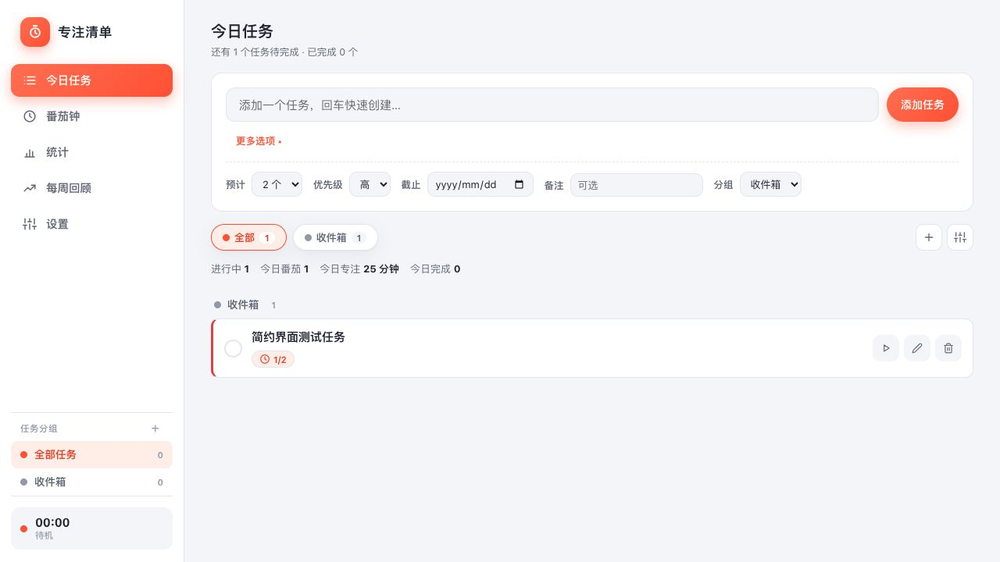

# 🍅 专注清单 · 番茄钟

一个完全本地运行的番茄工作法应用：任务管理、彩色分组、番茄钟计时、系统通知提醒、统计图表、每周回顾与 AI 周报分析。

所有数据保存在本机 **SQLite 数据库**（`app/focuslist.db`），不依赖任何外部服务，也不会上传任何数据。



## ✨ 功能

- **任务管理**：添加任务、预计番茄数、优先级、截止日期、备注、完成状态
- **任务分组**：创建彩色分组（工作 / 学习 / 生活…），支持重命名、改颜色、删除（组内任务自动移回收件箱）；「收件箱」也可重命名或隐藏（可在设置里恢复）
- **番茄钟**：专注 / 短休息 / 长休息，点击圆环开始暂停，空格键快捷操作
- **计时续接**：刷新页面后自动恢复计时，按真实时间继续倒计时；暂停状态也会保留
- **完成提醒**：结束弹窗 + 提示音 + 系统桌面通知（可在设置里测试）
- **统计**：今日 / 最近 7 天图表、本周目标、任务专注排行
- **每周回顾**：周汇总、每日明细、本周任务明细
- **AI 分析**：可选接入任意 OpenAI 兼容大模型（Base URL / API Key / 模型），生成每周回顾；不配置时使用内置本地智能分析；分析由本地服务转发，密钥只保存在本机
- **菜单栏常驻计时**：可选小工具在系统菜单栏实时显示剩余时间（🍅/🍵/🌙）
- **到点系统弹窗**：即使浏览器标签页在后台或已关闭，番茄钟到点也会弹出置顶提醒窗口

## 🚀 快速开始

**方式一（推荐，macOS）**：双击 `app/启动专注清单.command`，终端会自动启动服务并打开浏览器。

**方式二（命令行）**：

```bash
cd app
python3 server.py
```

然后浏览器访问 http://localhost:8765 （服务启动后也会自动打开浏览器）。

> 服务已注册为 macOS 后台任务（LaunchAgent `com.focuslist.server`）：开机自启、异常退出自动拉起，锁屏/休眠不受影响。运行 `scripts/start.sh` 时如果服务已在运行，会直接打开浏览器。

> 依赖：仅需 Python 3，无需安装任何第三方库。
> 端口默认 8765，可通过 `PORT=9000 python3 server.py` 修改。

## 📊 系统菜单栏计时（可选）

番茄钟运行时会同步状态到本地服务，可启用一个系统菜单栏小工具常驻显示剩余时间：

- 位置：`app/menubar-timer/`
- 已注册开机自启（LaunchAgent：`com.focuslist.menubar-timer`）
- 修改代码后重新构建：`cd app/menubar-timer && ./build.sh`

## 🔒 数据与隐私

- 数据库文件：`app/focuslist.db`（SQLite）
- 计时状态：`app/timer-state.json`（供菜单栏工具读取）
- 以上数据文件均在 `.gitignore` 中，**不会进入版本库**
- 设置页可查看数据库路径、导出 JSON 备份、一键清空数据

## 📁 项目结构

```text
.
├── app/                     # Web 应用（index.html + server.py + SQLite）
│   ├── 启动专注清单.command  # macOS 一键启动脚本
│   ├── README.md            # 应用使用说明
│   └── menubar-timer/       # 系统菜单栏计时工具（Swift）
├── assets/                  # 图标与截图
├── scripts/                 # 启动脚本
├── skills/                  # Codex 技能定义（focuslist）
└── .codex-plugin/           # Codex 插件元信息
```

## 🌐 本地服务 API

| 方法 | 路径 | 说明 |
| --- | --- | --- |
| GET | `/api/state` | 读取全部数据（tasks / sessions / settings / groups） |
| POST | `/api/state` | 整库导入（仅用于旧数据迁移） |
| DELETE | `/api/state` | 清空所有数据 |
| POST | `/api/task` | 新增 / 更新任务 |
| DELETE | `/api/task?id=xx` | 删除任务 |
| POST | `/api/session` | 新增番茄 / 休息记录 |
| POST | `/api/settings` | 保存设置 |
| POST | `/api/ai/chat` | 转发大模型请求（AI 分析） |
| GET | `/api/timer` | 读取当前番茄钟状态（菜单栏工具使用） |
| POST | `/api/timer` | 同步番茄钟状态 |
| GET | `/api/info` | 数据库路径等信息 |

## 🛠️ 维护

- 本项目通过 Git 维护在 https://github.com/HeyManLean/focus-list
- 修改后：`git add -A && git commit -m "..." && git push`
- 菜单栏工具为 Swift 源码（`app/menubar-timer/main.swift`），构建产物不入库
